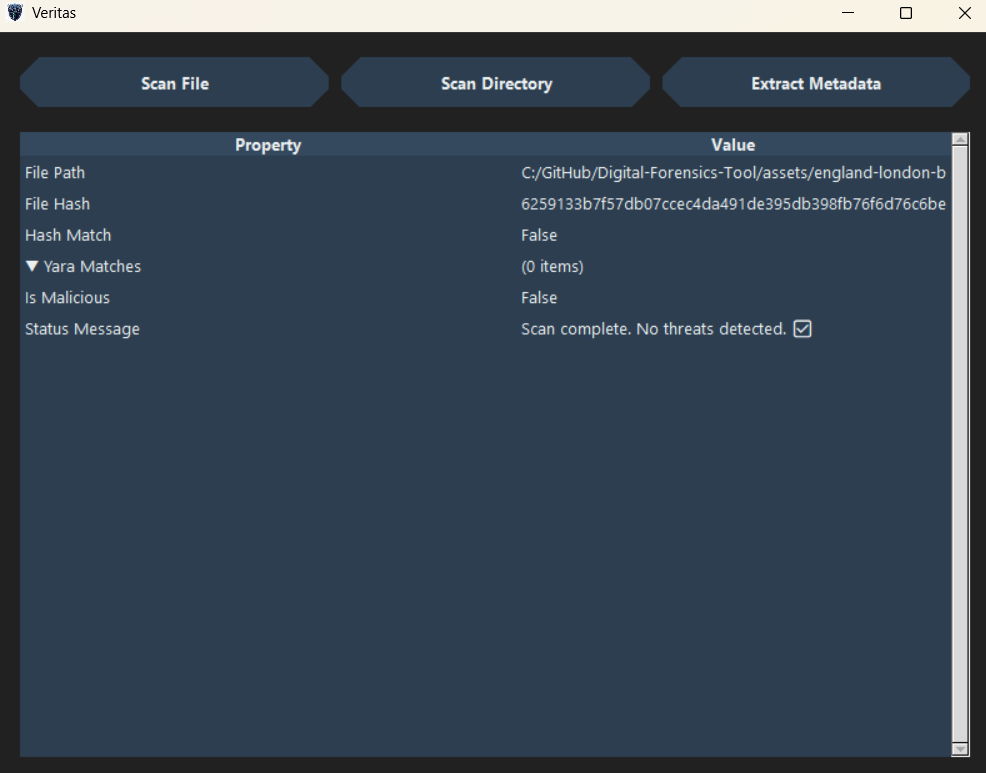

# Veritas


A Python-based desktop application designed for basic digital forensics and static malware analysis. This tool provides a user-friendly interface to quickly analyze files, extract metadata, and scan for potential threats using YARA rules and hash matching. It was developed as a learning project to explore key concepts in cybersecurity and software development.

## 📸 Screenshots

*Screenshot of the main interface:*


*Example of metadata extraction results:*


## ✨ Key Features

This tool offers a range of features for static file analysis:

-   **Recursive Directory Scanning:** Scan entire folders and their subfolders for threats in one go.
-   **YARA Rule Scanning:** Leverage the power of YARA to identify malware based on textual or binary patterns. The tool is designed to load rule sets from a dedicated directory.
-   **Malicious Hash Detection:** Check a file's SHA-256 hash against a user-provided list of known malicious hashes.
-   **Comprehensive Metadata Extraction:**
    -   **Images (JPEG, PNG):** Extracts standard EXIF data.
    -   **Geolocation:** Parses GPS data from photos and performs reverse geocoding to find the physical address where the photo was taken.
    -   **PE Files (EXE, DLL):** Extracts compilation timestamps, imported libraries (DLLs), and other executable headers.
    -   **(Future Support)** PDF, Microsoft Office documents.
-   **Meaningful String Extraction:** Scans any file's binary content to find and display valuable forensic artifacts like:
    -   IP Addresses
    -   URLs
    -   Email Addresses
    -   File Paths (Windows & Linux)
-   **Modern & Themed UI:** A custom-built dark-themed graphical user interface for a clean and pleasant user experience.

## 🛠️ Technologies & Libraries Used

-   **Python 3:** The core programming language.
-   **Tkinter:** For building the native graphical user interface.
-   **Pillow:** For image processing and EXIF metadata extraction.
-   **pefile:** For parsing Windows Portable Executable (PE) files.
-   **yara-python:** For integrating YARA scanning capabilities.
-   **geopy:** For reverse geocoding GPS coordinates into street addresses.

## 🚀 Setup and Installation

Follow these steps to get the project running on your local machine. It's highly recommended to run this in a controlled environment or a Virtual Machine like Kali Linux for security analysis purposes.

### Prerequisites

-   Python 3.8 or higher
-   `pip` (Python package installer)

### Installation Steps

1.  **Clone the repository:**
    ```bash
    git clone [https://github.com/sorarthur/Veritas.git](https://github.com/sorarthur/Veritas.git)
    cd Veritas
    ```

2.  **Create and activate a Python virtual environment (Recommended):**
    ```bash
    # Create the environment
    python3 -m venv venv

    # Activate it (on Linux/macOS)
    source venv/bin/activate

    # On Windows
    # venv\Scripts\activate
    ```

3.  **Install the required dependencies:**
    ```bash
    pip install -r requirements.txt
    ```
    *(Note: You should create a `requirements.txt` file containing all the libraries mentioned in the "Technologies & Libraries Used" section.)*

4.  **Set up YARA Rules:**
    -   Create a directory named `yara_rules` in the project's root.
    -   Download a set of general-purpose YARA rules. A great starting point is the set from **YARA Forge**.
    -   Place your `.yar` files inside the `yara_rules` directory.

## Usage

Once the setup is complete, run the main application file from your terminal:

```bash
python3 main_ui.py
```

### Usage

The application provides three main functions through its user interface:

-   **`Scan File`**: Prompts you to select a single file. It then performs a security scan against the provided `malicious_hashes.txt` and all `.yar` rules located in the `yara_rules` directory.

-   **`Scan Directory`**: Prompts you to select a directory. The tool will recursively scan every file within that directory and its subdirectories, reporting any findings in a summary table.

-   **`Extract Metadata`**: Prompts you to select a single file to perform a deep analysis. It extracts all available metadata (like EXIF/GPS for images) and any meaningful strings (IPs, URLs, emails, etc.) found in the file's binary content.

---
### 📁 Project Structure

The project is organized into the following directory structure:

```/
|-- main_ui.py            # Main application file, handles the GUI and user interaction
|-- malware_scanner.py    # Core logic for hash and YARA scanning (files and directories)
|-- metadata_extractor.py # Logic for metadata and meaningful string extraction
|-- malicious_hashes.txt  # User-provided list of known malicious SHA-256 hashes
|-- requirements.txt      # Python dependencies for pip
|
|-- yara_rules/           # Directory for YARA rule files (.yar)
|   |-- core.yar          # (Example) Core YARA ruleset
|
|-- assets/               # Directory for UI assets
|   |-- logo.ico          # Application icon
|
|-- README.md             # This file
```
